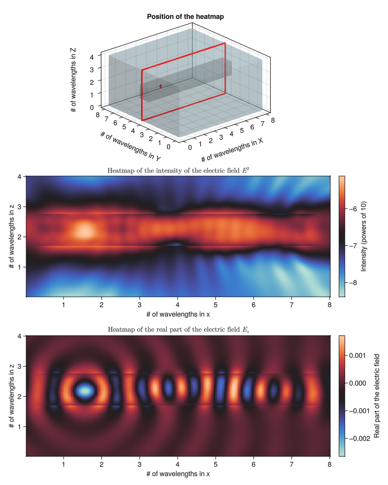

# GilaElectromagnetics.jl

*Greens in linear algebra*

[](https://github.com/moleskySean/GilaElectromagnetics.jl/actions)
[](http://codecov.io/github/moleskySean/GilaElectromagnetics.jl?branch=main)
[](https://moleskySean.github.io/GilaElectromagnetics.jl/stable)
[](https://moleskySean.github.io/GilaElectromagnetics.jl/dev)

[GilaElectromagnetics.jl](https://github.com/moleskySean/GilaElectromagnetics.jl)
is a Julia package that provides a very efficient implementation of the discrete
three-dimensional electromagnetic Green function. Documentation for the package
can be found
[here](https://moleskysean.github.io/GilaElectromagnetics.jl/stable).

## Installation

Installation can be done with Julia's package manager:

```julia-repl
julia> using Pkg
julia> Pkg.add("GilaElectromagnetics")
```

Alternatively, in Julia's REPL, a typing `]` puts you in ["Pkg
mode"](https://docs.julialang.org/en/v1/stdlib/Pkg/). In this command line
package manager, installing GilaElectromagnetics can be done as follows:

```
(@v1.10) pkg> add GilaElectromagnetics
```

## Showcase

The following figures demonstrate the capabilities of GilaElectromagnetics to
solve the scattering problem very efficiently. The first one shows the resulting
total electric field in a plane of a 3D system. An electric dipole is located 
in a wave guide measuring 256x34x34 cells, each with a size of 1/32 of a wavelength. 
It is itself embedded in a vacuum of 256x256x128, making the total simulated domain
8x8x4 wavelengths:



The next one represents the total electric field in a vacuum of the same size, but
where a plane wave hits a thin film of dielectric (thickness of 24 cells, or 3/4 of
a wavelength) at a steep 80.5° from the normal of the film :


Further details and more examples are provided in the documentation.
