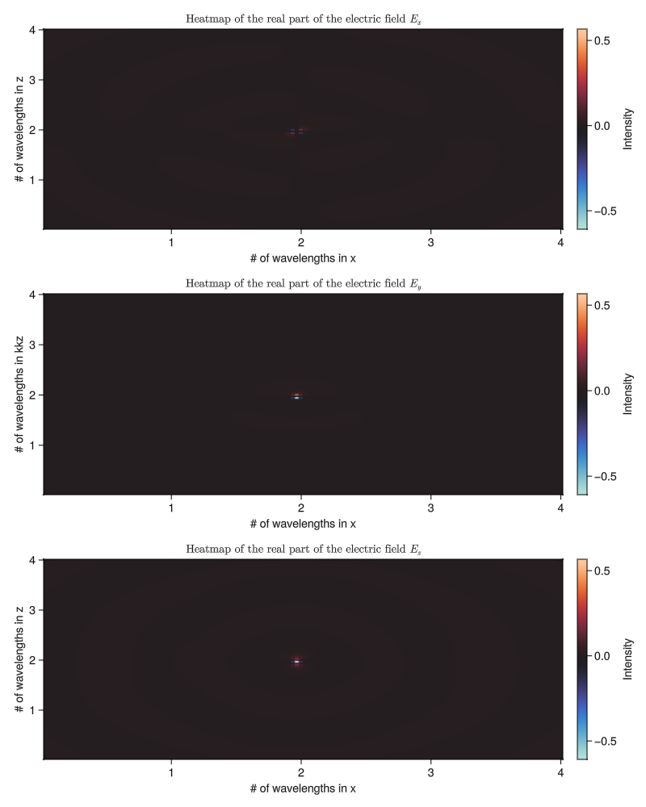
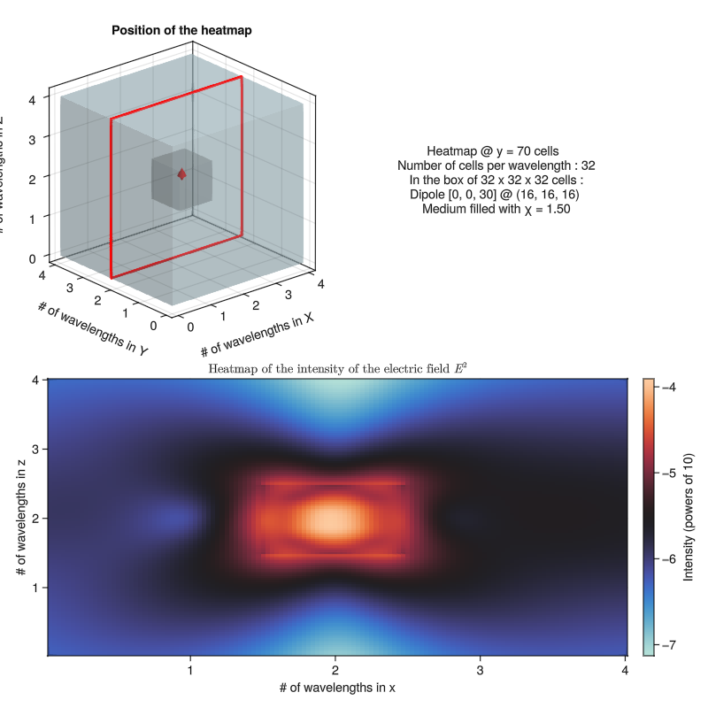
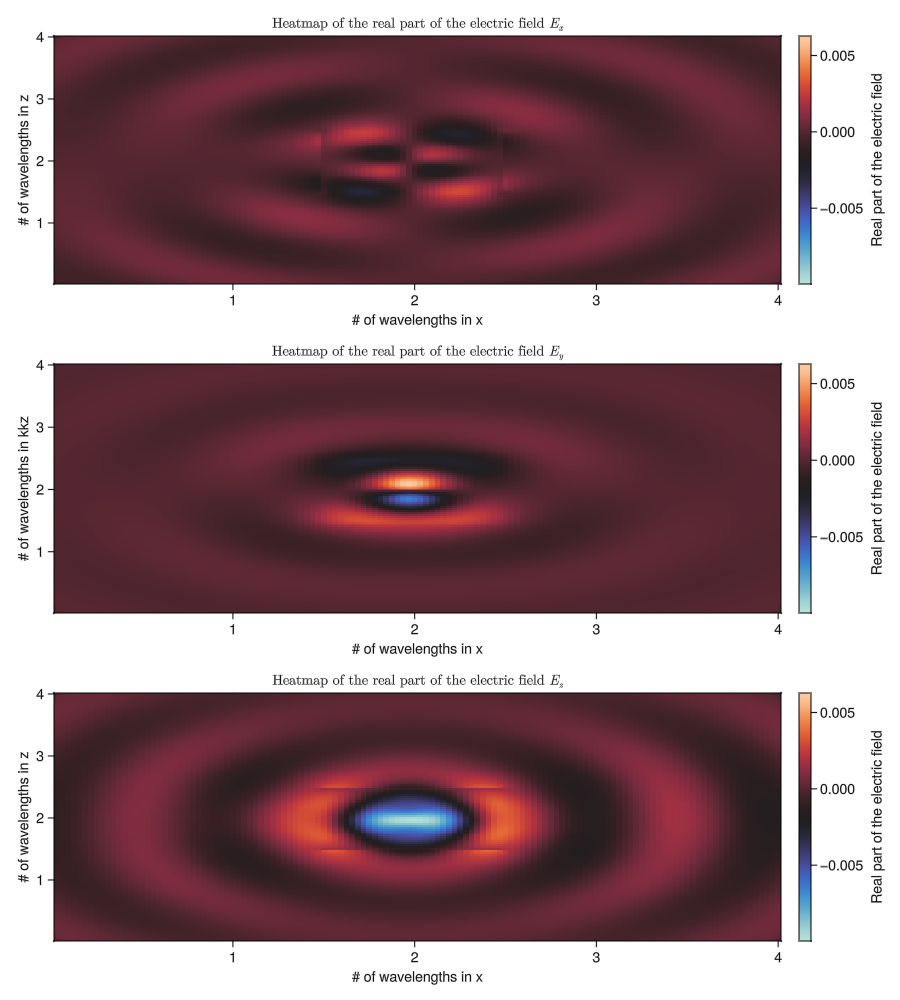

# Examples

The following section serves as a showcase of possible applications of GilaElectromagnetics. Every one of them assumes that the operators presented in the [usage](usage.md) section were defined beforehand. Only the most important parts of the source code that made the shown figures are presented here, otherwise this section would be unnecessairly long.

For all cases presented, the following packages must be imported :

```julia
# Computation
using Base.Threads
using FFTW
using IterativeSolvers
using LinearAlgebra
using LinearAlgebra.BLAS
using Random
using ..GilaOperators
using CUDA

# Plotting
using GLMakie
using GeometryBasics
using Colors
using Printf
```
Also, to ensure consistency for packages that themselves use `Random`, the following line is included :

```julia
Random.seed!(0)
```

All code sections presented below are written for maximum clarity. They could be rewritten more concisely, which could be better for certain users.

## Dipole in a cube

This first example is the simplest. A single electric dipole ``\textbf{p}_i`` will be placed approximately in the middle of a dielectric cube, itself embedded in empty space. The objective is to visualise the resulting electric field. Both the intensity and the real part (in every direction) are of interest.

### Volume and medium

To begin, we define most of the relevant physical quantities to describe the system :

```julia
# dimensions
num_cells_side = 32 # defines cube of 32x32x32
num_cells_side_vac = 128 # defines cube of 128x128x128
cells_per_wavelength = 32

# medium
χ_fill = ComplexF32(1.5 + 0im)

# source (dipole)
pos_x = 16
pos_y = 16
pos_z = 16
dip_x = 0
dip_y = 0
dip_z = 30

# visualisation
dst_slice = 64
```

Special must be taken when specifying the type of complex variables while using Gila. The user must either use `ComplexF32` for speed and memory gains, or `ComplexF64` for accuracy gains. It is not recommended to mix these two types in one single script, hence why their declaration is explicit in the code presented.

Next, the computation using Gila can be done, but only for the inside of the dielectric. We cannot just solve for both the dielectric and the empty space, because the solver doesn't converge for `χ = 0`. We can use the exact same logic as presented in the scattering section of the [usage](usage.md) page :

```julia
# memory for volume
cells = (num_cells_side, num_cells_side, num_cells_side)
scale = (1//cells_per_wavelength, 1//cells_per_wavelength, 1//cells_per_wavelength)
coord = (0//1, 0//1, 0//1)

# memory for medium (small cube of dielectric)
χ = fill(χ_fill, num_cells_side, num_cells_side, num_cells_side)

# Lippmann-Schwinger operator
ls = LippmannSchwinger(cells, scale, χ; set_type=ComplexF32)

# memory for dipole
p_i = zeros(eltype(ls), num_cells_side, num_cells_side, num_cells_side, 3)
p_i[pos_x, pos_y, pos_z, :] = [dip_x, dip_y, dip_z]

# solution for total polarisation current density 
p_t = solve(ls, p_i)
```

### Embedding in empty space

We now have `p_t`, which is only present in the dielectric cube. A trick to solve for the fields is to embed this array in a bigger one filled with zeros, which represents empty space. It makes physical sense because where there is no matter there cannot be presence of a dipole. This can be implemented in the following way :

```julia
# memory for volume with empty space
cells_vac = (num_cells_side_vac, num_cells_side_vac, num_cells_side_vac)

# position of small cube within bigger one
# this is specifically to position it near the middle
pos_cube_begin = Int((num_cells_side_vac / 2) - (num_cells_side / 2))
pos_cube_end = Int((num_cells_side_vac / 2) + (num_cells_side / 2) - 1)

# insert the p_t vectors in the empty space
p_t_vac = zeros(ComplexF32, num_cells_side_vac, num_cells_side_vac, num_cells_side_vac, 3)
p_t_vac[pos_cube_begin:pos_cube_end, pos_cube_begin:pos_cube_end, pos_cube_begin:pos_cube_end, :] .= p_t
```

With the sources embedded in empty space, nothing prevents the generation of a Green's operator. Thus, the field can be obtained like this :

```julia
# memory for Green's function
G_0_vac = load_greens_operator(tuple(cells_vac...), scale; set_type=ComplexF32)

# obtaining the electric field
e_t_vac = G_0_vac * p_t_vac
```

This is what we aimed to obtain. All that remains is to visually represent this field.

!!! note "Alternative trick for empty space"
    If one wants to define ``\chi`` with some empty space cells, it is possible to give a very low suceptibility value to approximate ``\chi = 0``. Of course, this comes at a loss of accuracy, but it might be good enough depending on the use case when empty space is approximated at ``\sim 10^{-5}``.

    In the future, a preconditionner for the solver will allow materials of value ``\chi \leq 0`` to have a solution that converges, making the workarounds irrelevant.

### Visualisation

The visualisation source code for the figures on this page will be available, but is not as relevant as the solving steps in the context of the GilaElectromagnetics package. Quick tips will be provided to guide towards a clear representation of the physics, but the presentation of the results will be straightforward.

The central package used for visualisations is [makie.jl](https://docs.makie.org/stable/). It allows for the most options compared to it's alternative when it comes to interactivity and customisability. As seen in the list of packages above, `GLMakie` is used as the choice of backend package to harness the power of a dedicated graphics card with *OpenGL*.

We have obtained a 3D vector field in the previous section. The first way one would think of representing it visually is with a function such as `arrows`, where every cell has it's electric field vector represented. The problem with the 3D nature of the field is that such a representation gets *extremely* cluttered. It is advised to choose a 2D plane within the 3D field as a way to declutter the view.

It is not guaranteed however that the vectors within the 2D plane are coplanar to it, which leads to akwardness in the usage of the `arrows` function in 2D plane. This is why the presented figures here show *heat maps* as a way to show the data. Using Makie's `heatmap` function accompanied with `Colorbar`, it is possible to reprent the intensity and the real parts of the electric field in a plane of the volume in a clear and intuitive way.

In the initialisation of the volume and the medium, the parameter `dst_slice` was set. If the plane represented was in directions `xz`, this would mean that the slice is taken at the set number of cells from the origin. This can be seen in the following image where the heat map of the intensity ``E^2`` is accompanied by a visual aid and information on the system :
    


This image represents the exact physical case with the numeric values presented above in the `xz` plane. For clarity and since the intensity is strictly positive, the color scales logarithmically. In addition, the real part of the electric field vector in every cartesian direction, respectively ``E_x``, ``E_y``, ``E_z``, for this same system is shown here :



As it can be seen, the values of the electric field at the dipole saturate the color map. To see more clearly the behavior of the field as it gets further away from the dipole, the same figures were made but with the plane of visualisation further away from the dipole, at `dst_slice = 70` :



For the real part at this distance of visualisation :



The decay of the field with the behavior on the edge of the cube is as expected.

## Dipole in a wave guide

Similarly, the second example shows an electric dipole located in a wave guide. The same process of embedding the dielectric in a bigger space will be used.

### Volume and medium

Very similarly to the cube, we define relevant physical quantities, with more granularity on the dimensions of the volumes. The embedding position of the dielectric in vacuum is predetermend here, where the `position_guide` variables give the number of cells between the beginning of the guide and the relevant plane crossing the origin :

```julia
# dimensions of guide
num_cellsx = 256
num_cellsy = 34
num_cellsz = 34

# dimensions of space
num_cellsx_vac = num_cellsx
num_cellsy_vac = 256
num_cellsz_vac = 128
cells_per_wavelength = 32

# location of guide (only intended for guide along x)
position_guide_y = 110
position_guide_z = 55

# medium
χ_fill = ComplexF32(1.5 + 0im)

# source
pos_x = 50 
pos_y = 16
pos_z = 16
dip_x = 0
dip_y = 0
dip_z = 10

# visualisation
dst_slice = 135
slice_id = "xz"
```

As specified in a comment, this prepares a wave guide along the x axis only, but the program can be modified for any direction. 

### Decay and loss at boundaries

An important detail must be adressed before solving for the electric field. A key difference with the cube example is that the dielectric goes all the way to the edges of the defined volume. A conventional wave guide would be normally treated under an approximation of infinite length, because it's length is much bigger than the size of it's cross section. Here, the edges prevent this approximation, because the computation treats them as a medium-vacuum interface.

To massively reduce the impact of this interface, we can introduce a gradual decay of ``\Re(\chi)``, which makes the transition from dielectric to vacuum much smoother, reducing reflection effects in the guide. In addition, we can gradually introduce loss in the medium, by increasing ``\Im(\chi)`` when approaching the boundary.

The following function scales the decay with a ``\tanh`` function, going from ``\Re(\chi)\times\tanh(3)`` to ``\Re(\chi)\times\tanh(-3)`` as the boundary approaches. This decay happens on a length determined by the parameter `decay_length` given in number of wavelengths. Similarly, loss is introduced on this same length proportionally to ``x^2``, going from ``\Im(\chi) = 0`` to ``\Im(\chi) = 0.1`` : 

```julia
function medium_decay_tanh!(cells, χ, χ_fill, d)
  for i in 1:d
    χ[d-i+1, :, :, :] .= (χ_fill / 2) * ( tanh((6/d) * (-i + (d/2))) + 1 ) + ( (0.1/(d^2))*((i-d-1)^2) )im
    χ[cells[1] - d + i, :, :, :] .= (χ_fill / 2) * ( tanh((6/d) * (-i + (d/2))) + 1 ) + ( (0.1/(d^2))*((i-d-1)^2) )im
  end
end
```

Applying this function to the already defined medium will greatly help the simulations to have intended results everywhere except where the decay and loss happens. In these locations, the fields should simply vanish.

!!! note "`function()` VS `function!()`"
    A typical `function` returns something, while a `function!` modifies one or more of it's input variables. The `!` is Julia convention to indicate this fact.

    As an example, `medium_decay_tanh!` modifies the `χ` variable directly. Some functions in Gila use this convention, notably `egoOpr!` and other internal functions.

### Solutions

Solving for the field is just like the cube case, with the addition of the decay function. A script to obtain it would look like this :

```julia
# solving in the dielectric
cells = (num_cellsx, num_cellsy, num_cellsz)
scale = (1//cells_per_wavelength, 1//cells_per_wavelength, 1//cells_per_wavelength)
coord = (0//1, 0//1, 0//1);

χ = fill(χ_fill, num_cellsx, num_cellsy, num_cellsz)
decay_length = 1
medium_decay_tanh!(cells, χ, χ_fill, decay_length * cells_per_wavelength);

ls = LippmannSchwinger(cells, scale, χ; set_type=ComplexF32)

p_i = zeros(eltype(ls), num_cellsx, num_cellsy, num_cellsz, 3)
p_i[pos_x, pos_y, pos_z, :] = [dip_x, dip_y, dip_z]

p_t = solve(ls, p_i)

# embedding in empty space
cells_vac = (num_cellsx, num_cellsy_vac, num_cellsz_vac)

end_guide_y = position_guide_y + num_cellsy - 1
end_guide_z = position_guide_z + num_cellsz - 1

p_t_vac = zeros(ComplexF32, num_cellsx, num_cellsy_vac, num_cellsz_vac, 3)

p_t_vac[:, position_guide_y:end_guide_y, position_guide_z:end_guide_z, :] .= p_t

G_0_vac = load_greens_operator(tuple(cells_vac...), scale; set_type=ComplexF32)

e_t_vac = G_0_vac * p_t_vac
```

We can now visualise the field in the guide with heatmaps, with the viewed plane slightly away from where the dipole is so that the gradient of color is less saturated :

#############

For the real parts :

#############

We can also analyse the field in the `yz` plane to see how it leaks out of the guide :

#############

And finally, for the real parts :

#############

## Incident wave on a thin film

As the final example, we will analyse the behavior of a plane wave hitting a thin film of dielectric. The general process is still the same, but the treatement of the wave itself is worth discussing.

### Volume and medium

We define the information on the volume and the medium withe the following variables :

```julia
# dimensions
num_cellsx = 256
num_cellsy = 256
num_cellsz = 24
num_cellsz_vac = 128
cells_per_wavelength = 32

# medium
position_film = 52
χ_fill = ComplexF32(1.5 + 0im)
decay_length = 1

# visualisation
dst_slice = 128
```

Because the film goes all the way to the edges of the volume, we need to apply decay and loss again, but this time for two directions. The following function accomplishes this as it was described for the guide :

```julia
function medium_decay_tanh!(cells, χ, χ_fill, d)
  for i in 1:d
    χ[d-i+1, :, :, :] .= (χ_fill / 2) * ( tanh((6/d) * (-i + (d/2))) + 1 ) + ( (0.1/(d^2))*((i-d-1)^2) )im
    χ[cells[1] - d + i, :, :, :] .= (χ_fill / 2) * ( tanh((6/d) * (-i + (d/2))) + 1 ) + ( (0.1/(d^2))*((i-d-1)^2) )im
  end
  for i in 1:d
    for x in 1:cells[1]
      if real(χ[x, d-i+1, 1, 1]) > real((χ_fill / 2) * ( tanh((6/d) * (-i + (d/2))) + 1 ))
        χ[x, d-i+1, :, :] .= (χ_fill / 2) * ( tanh((6/d) * (-i + (d/2))) + 1 ) + ( (0.1/(d^2))*((i-d-1)^2) )im
        χ[x, cells[2] - d + i, :, :] .= (χ_fill / 2) * ( tanh((6/d) * (-i + (d/2))) + 1 ) + ( (0.1/(d^2))*((i-d-1)^2) )im
      end
    end
  end
end
```

### Electric field

We need to create a function that generates a plane wave, and then use it to define the initial polarisation current density required to use the solver. An electric wave can be described as the following :

```math
\textbf{E} = \textbf{E}_0 e^{i(\textbf{k}\cdot\textbf{r}-ωt)}
```

where the amplitude of ``\textbf{E}_0`` describes the amplitude of the wave, it's direction dictates the direction of the electric field (the polarisation of the wave), ``\textbf{k}`` is the wave vector which dictates both wavelength and the direction of the wave front, ``\textbf{r}`` represents a point in space, and ``ωt`` represents a phase factor that will be set to 0 arbitrairly going forward.

...

### Solutions


### Different angles


### GPU example
