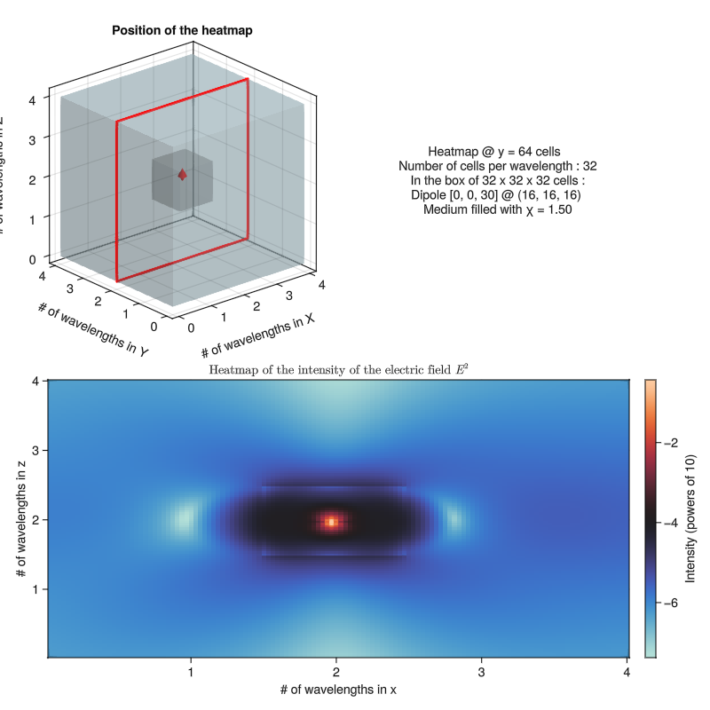

# Examples

The following section serves as a showcase of possible applications of GilaElectromagnetics. Every one of them assumes that the operators presented in the [usage](usage.md) section were defined beforehand.

## Dipole in a cube

This first example is the simplest. A single electric dipole will be placed approximately in the middle of a dielectric cube, itself embedded in empty space.

### Volume and medium

### Embedding in empty space

one image aligned to the dipole, one off axis

## Dipole in a wave guide

Similarly, the second example shows an electric dipole located in a wave guide. The same process of embedding the dielectric in a bigger space will be used.

### Volume and medium

### Decay at boundaries

A key difference with the cube example is that the dielectric goes all the way to the edges of the defined volume. To mitigate unwanted behavior that would result from an

minimap, then graphics.

## Incident wave on a thin film

### Different angles

### GPU example?
